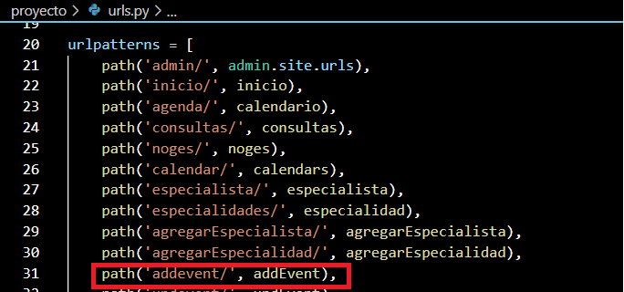

# proyecto_titulo

En estas líneas de no-codigo se comentarán las funcionalidades más importantes del sistema.

FullCalendar: Para satisfacer la necesidad de gestionar las actividades calendarizadas de los especialistas que estén registrados en el sistema, se utilizó FullCalendar,
un plugin que permite crear un calendario y registrar eventos en el.

Para cada especialista registrado en el sistema, se desplegará un calendario único con eventos únicos. Al momento de realizar cualquier CRUD entre los eventos
de un especialista y el calendario, se realiza una petición AJAX hacia el servidor solicitando acceso a la BD. (static/js/agenda/agenda.js)

En el AJAX de este ejemplo, se envían los datos del evento recién arrastrado al calendario junto al id del especialista.

El evento se registra en la base de datos y retorna el id que se le ha asignado al evento en la BD. 

Luego de que la comunicación ha sido efectiva y el evento ha sido almacenado en la base de datos, el evento se guarda en la lista que contiene todos los eventos del especialista desplegados en el calendario actual, asignandole la id que se le asignó en la BD para así gestionarlo desde el frontend.
